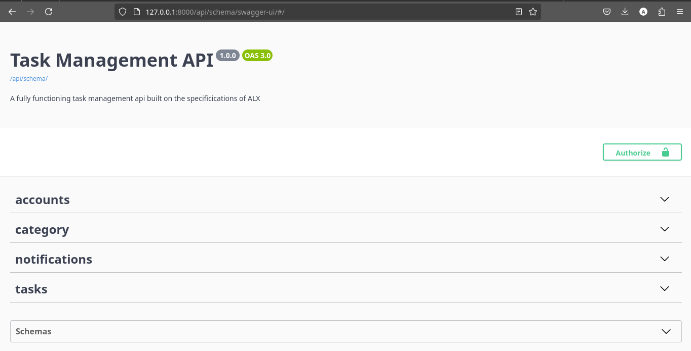
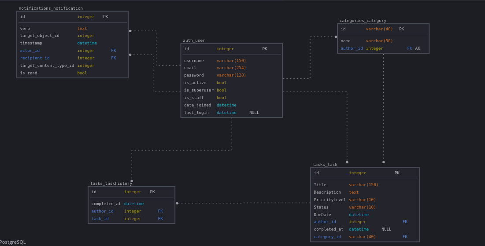

# Task Management API

This is the final project required to graduate from the ALX Backend Web Development course.


## Introduction

The Task Management API is a robust and scalable backend service designed to manage tasks efficiently. It provides endpoints for creating, updating, deleting, and retrieving tasks. This API is built with a focus on performance, security, and ease of use.

## Features

- **Task Creation**: Create new tasks with various attributes such as title, description, due date, and priority.
- **Task Retrieval**: Retrieve tasks based on different criteria such as status, priority, and due date.
- **Task Update**: Update existing tasks to change their attributes.
- **Task Deletion**: Delete tasks that are no longer needed.
- **Task History**: Manage a history of previously completed tasks.
- **Categorization**: Create and use Default categories to section tasks into related fields.
- **Notification System**: Manages sending of notifications after certain action are performed.
- **User Authentication**: Secure endpoints with user authentication and authorization.
- **Pagination**: Efficiently handle large sets of tasks with pagination.
- **Sorting**: Sort tasks based on different attributes such as due date, priority, and status.
- **Filtering**: Filter tasks based on different attributes such as due date, priority, and status.

## Database Design

The database design is illustrated in the image below:



## Installation

To install and run the Task Management API, follow these steps:

1. **Clone the repository**:

    ```sh
    git clone https://github.com/Ecode2/Alx_Capstone_Project.git
    cd Alx_Capstone_Project/Task_Management_Api
    ```

2. **Install dependencies**:

    ```sh
    pip install -r requirements.txt
    ```

3. **Copy the environmental variable file**:

    ```sh
    cp .env.example .env
    ```

4. **Set environmental variables for development**:

    ```python
    SECRET_KEY="Your Secret Key"
    DEBUG=True
    ```

5. **Set up the database**:

    ```sh
    python manage.py makemigrations
    python manage.py migrate
    ```

6. **Run the development server**:

    ```sh
    python manage.py runserver
    ```

## Deployment

The API is deployed on Railway. You can access the live API [HERE](https://alxcapstoneproject-production.up.railway.app/).

## Platform and Workflow

The project uses a CI/CD pipeline with the following workflow:

1. **Test**: Automated  tests are run using GitHub Actions Continous Integration to ensure code quality.
2. **Deploy**: The project is deployed to the specified platform after all CI actions are successful.

## Additional Information

- **API Documentation**: Detailed API documentation is available at [Swagger Redoc](https://alxcapstoneproject-production.up.railway.app/).
- **License**: This project is licensed under the MIT License. See the [LICENSE](/LICENSE) file for details.

For any questions or support, please contact Me on [X](https://x.com/abubakar_alaya?s=11).
